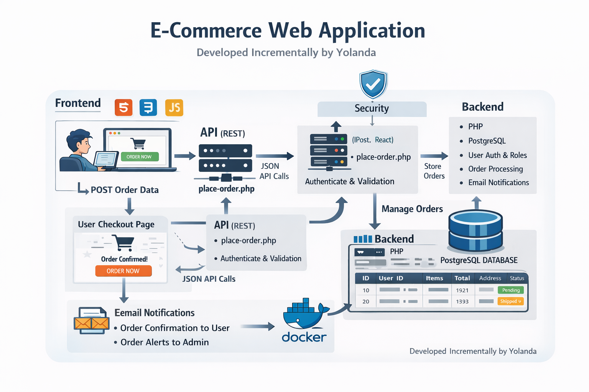
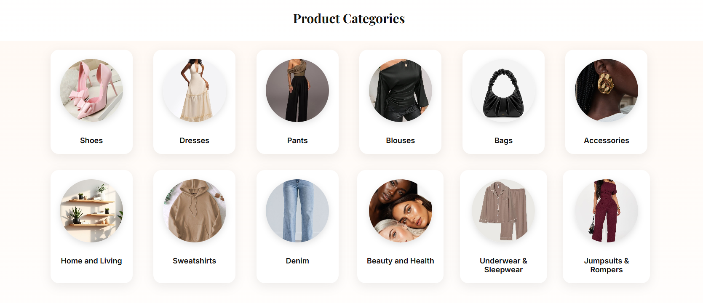
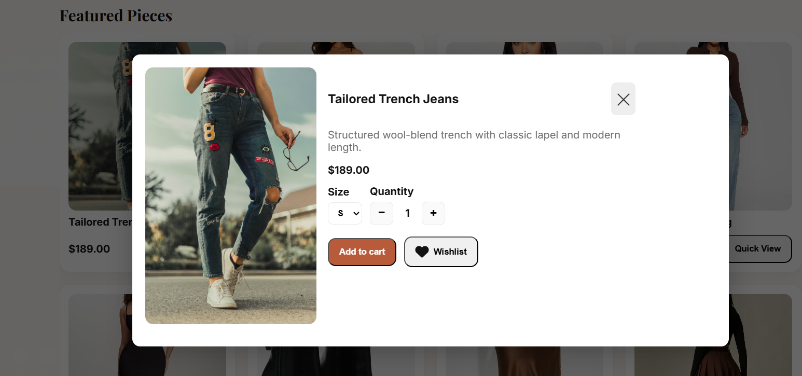
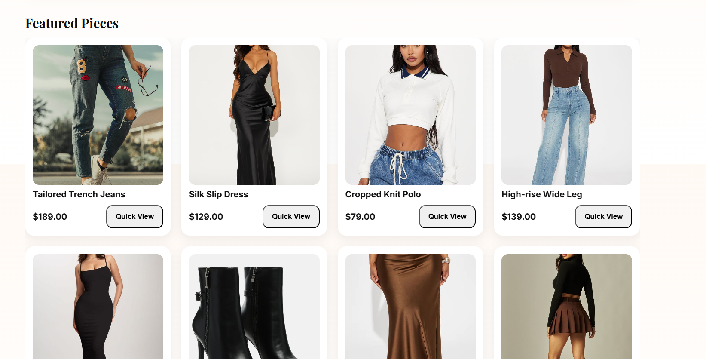
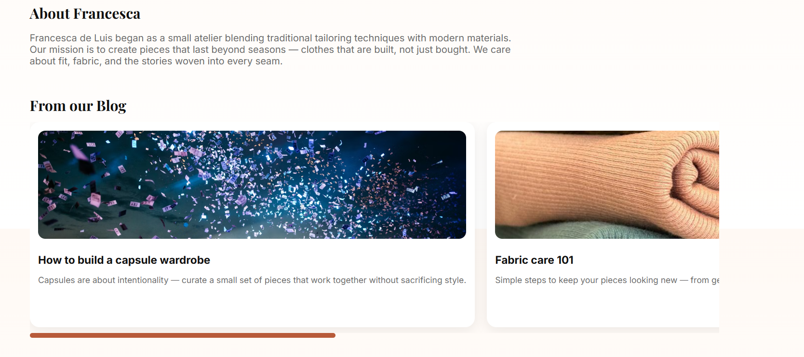
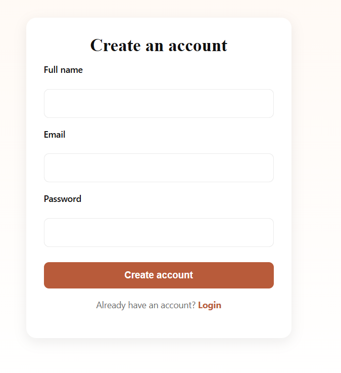
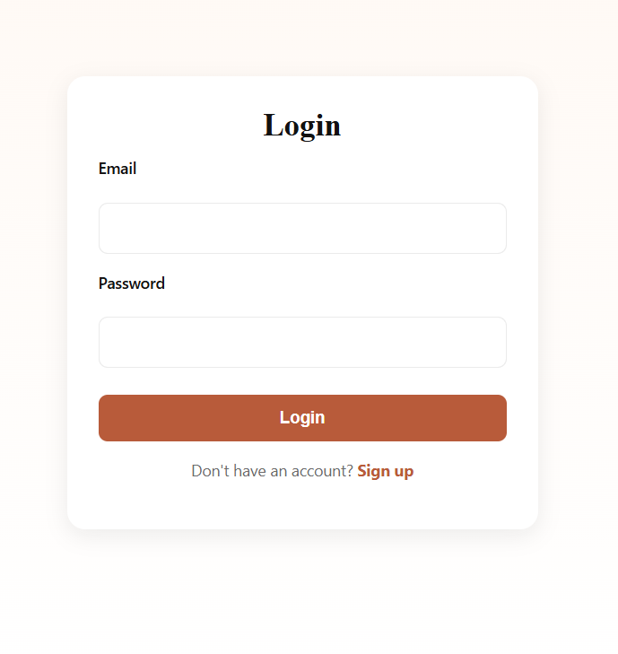
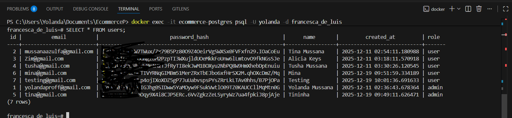
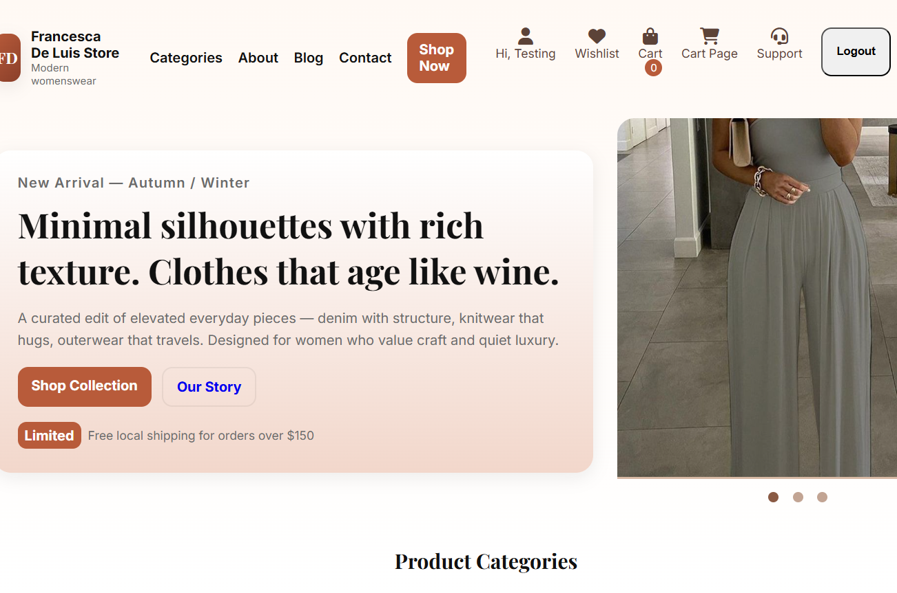
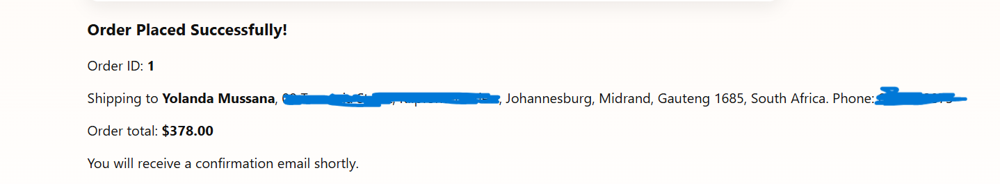

# Full-Stack Development for a Clothing Brand: Francesca De Luis


This is a full-stack e-commerce style web application built.  The goal of this project is to design and implement a real-world system that handles AUTHENTIFICATION, ORDERS, ADMIN MANAGEMENT, and BACKEND PROCESSING. An online store approached me and requested that I build a full stack project that accepts and places customers orders in real time.

The project is being built incrementally, with a focus on clean architecture, security, and practical functionality.

## Project Functionality

The site must allow users to browse products effortlessly, understand value immediately, and complete a purchase with minimal friction. That means a clean product catalogue with categories, and search that actually works. Each product page must convey trust, featuring clear pricing, high-quality images, detailed descriptions, an accurate availability status, and a visible call to action. 

Users must be able to create accounts, log in securely, manage their profiles, view order history, and receive transactional emails or notifications. Checkout must be fast, mobile-first, and localized for the market — meaning correct currency, relevant payment methods, and realistic delivery options.
Payments are a big part of the spec. The system must integrate with reliable payment gateways suitable for the region, handle failed transactions gracefully, and confirm orders only when payments are actually verified. 

On the backend, the platform must support full product management: adding, editing, and removing products; managing inventory levels; setting prices and discounts; and handling stock alerts. Order management is critical the admin must be able to see orders in real time, update statuses, manage cancellations or returns, and export data for accounting or analysis. 

The frontend is built with a modern JavaScript framework to ensure performance, responsiveness, and maintainability. The backend exposes clean APIs for products, users, orders, and payments. A relational database handles transactional data because e-commerce needs consistency. Authentication is handled securely, and the architecture allows features to be extended later without rewriting everything.

## Project Goals

The main goals of this project are to:

Build a complete frontend-to-backend workflow

Implement secure user authentication and role-based access control

Design and manage order processing logic

Work with APIs, databases, and Dockerized environments

Simulate real production patterns used in modern web applications

## Features
### Authentication & Authorization

Users can register and log in using a session-based authentication system. Sessions persist across pages, and protected routes are enforced on the backend. A role-based system is implemented using a role column in the users table, allowing differentiation between normal users and admins.

Admin-only APIs validate the logged-in user’s role before allowing access. A /me endpoint returns the authenticated user’s details, including their role, for frontend logic.

### Order Management

Authenticated users can place orders through the checkout flow. When an order is submitted, the backend validates the request, saves the order to the database, generates a unique order ID, and returns it to the frontend.
Orders store cart items and shipping information in JSON format, along with totals, status, and timestamps. The system is structured to allow future normalization into separate order and order_items tables.

### Admin Dashboard

An admin dashboard allows administrators to view all orders and update order statuses. This interface communicates with protected backend APIs and reflects real database data.

### Email Notifications

When an order is successfully placed, email notifications are sent to both the user and the admin. The admin receives order details, while the user receives a confirmation email containing their order ID and shipping information.

### Frontend Integration

The frontend communicates with the backend exclusively through API calls. Checkout actions clear the cart only after a successful backend response. Error handling is implemented for validation failures and network issues. The frontend is built with HTML, CSS, and JavaScript. The backend is written in PHP and exposes REST-style API endpoints. PostgreSQL is used as the database. Docker is used for local development and service orchestration. The frontend communicates with the backend through API endpoints. Authentication is handled via sessions, and user roles are checked server-side to protect sensitive routes. When a user places an order, the backend validates the request, saves the order to the database, sends email notifications, and returns an order ID to the frontend.

## Tech Stack
### Frontend

HTML5

CSS3

JavaScript (Vanilla JS)

Backend

PHP

REST-style API endpoints

### Database

PostgreSQL
### DevOps & Tooling

Docker

Docker Compose

Git & GitHub

Visual Studio Code

### Other Tools & Services

Email delivery via PHP mail configuration or third-party services (e.g. SendGrid)

JSON for structured data storage

Session-based authentication

## Architecture Overview

The frontend interacts with the backend through HTTP API requests. The backend handles authentication, validation, business logic, and database interactions. PostgreSQL serves as the persistent data store. Docker is used to containerize the backend and database for consistent local development.

## Database Schema

The database currently includes:

users table for authentication and roles

orders table for order storage (user ID, items, totals, shipping info, status, timestamps)

Additional tables such as order_items are planned as the system evolves.

Running the Project Locally

Ensure Docker and Docker Compose are installed. Clone the repository and start the services using Docker Compose. The backend and database will be started in containers.

Database setup scripts are included and must be run before using the application.

Once running, access the frontend through your local development server.

## Project Status

This project is under active development and is being built publicly. Features, structure, and implementation details may change as the system grows.

Planned Improvements

Payment gateway integration (Stripe or PayPal)

## Inventory tracking

Order item normalization

Improved admin tooling

Enhanced frontend responsiveness

## SEO optimization

Logging and monitoring

## Running the Project Locally

Clone the repository and ensure Docker is installed on your machine. Use Docker Compose to start the backend services and database. Once the containers are running, access the application through your local server address.


### Author
Yolanda Mussana

## STEP 1: Frontend development


As per client request, I have created a simple, clean and modern homw page for the ecommerce store. The home page consist of the categories section, blog, user account, wiahlist, cart, support section and many others listed. The client wanted me to stick with her colour scheme, which was well represented on the site.



The category section groups similar products together.



The modal sections enables users to view the deatured products listed on the site. The user can either add the product to the cart or add the product to the wishlist.



The featred pieces section display the most sought after items.





## User Authentification: Login and Create Pages




As specified by the cient, the user can create a users account securely to get access to the site information. One the user creates an account, the details are stored securely at the backend. No unauthorized user has access to the site. Passwords are securelty created and saved.



After the user has created a valid account, he/she will be directed to the login page to get access to the site. If one of the details in incorrectly entered, an error message will be displayed. For example, if the user enters a wrong password, the error handling messsage will show. If the user doesn't have an account, they will be directed to the create account page.


## Step 2: Backend Development

### Step 1: Create a docker compose. yml file

```
version: "3.9"

services:
  db:
    image: postgres:15
    container_name: ecommerce-postgres
    environment:
      POSTGRES_USER: yolanda
      POSTGRES_PASSWORD: demopassword
      POSTGRES_DB: francesca_de_luis
    ports:
      - "5432:5432"
    volumes:
      - postgres_data:/var/lib/postgresql/data

volumes:
  postgres_data:
```

Enter the databse container and create a users table

```
docker-compose exec db psql -U yolanda -d francesca_de_luis
```

```
CREATE TABLE users (
  id SERIAL PRIMARY KEY,
  full_name VARCHAR(100) NOT NULL,
  email VARCHAR(150) UNIQUE NOT NULL,
  password_hash TEXT NOT NULL,
  role VARCHAR(50) DEFAULT 'customer',
  created_at TIMESTAMP DEFAULT CURRENT_TIMESTAMP
);
```

### Step 2: Connecting the create account page to the database


Once the database was running, I defined the relational schema using SQL inside the database container. The main table created was users, which stores user information such as full name, email, hashed passwords, roles, and account creation timestamps. This setup ensured data integrity and enforceable constraints, like unique email addresses.

Next, I connected the backend to the database. The backend was handled by PHP, running in a Docker Apache container (ecommerce-web). I created a file named register.php that receives form submissions from the frontend, validates inputs, hashes passwords for security, and inserts new users into the PostgreSQL database.

On the frontend, I created register.html, which contains the user registration form. When a user submits the form, the data is sent via a POST request to register.php. The backend handles all processing and communicates directly with the database. After successfully storing the user, the backend returns a response confirming account creation.

This approach maintains clear separation of layers:

Frontend: register.html – collects user input

Backend: register.php – processes data, enforces security, connects to the database

Database: PostgreSQL running in Docker – stores persistent user data





### Step 3: Connecting the login page to the database

I implemented a secure login system for the e-commerce platform. The frontend login form (login.html) collects user credentials and submits them to the backend (login.php). The backend then connects to the PostgreSQL database running in Docker, looks up the user by email, and verifies the submitted password against the securely hashed password stored in the database. Only after successful verification does the backend authenticate the user, maintaining session integrity and ensuring the database remains secure. This setup ensures a seamless and safe login flow while adhering to best practices in password handling and data protection.



## Step 3: Order Management

I implemented an order creation system that allows authenticated users to place and store orders securely. After a user logs in, the frontend sends selected product and order details to a backend endpoint. The backend validates the request, confirms user authentication, and processes the order before storing it in a PostgreSQL database running in Docker. Orders are linked to users through relational database design, ensuring data integrity and enabling order tracking and history. This approach demonstrates a complete transaction flow from frontend interaction to persistent backend storage. Once the order is placed, the user will get an confirmation texts to show that the order has been successfully placed.




